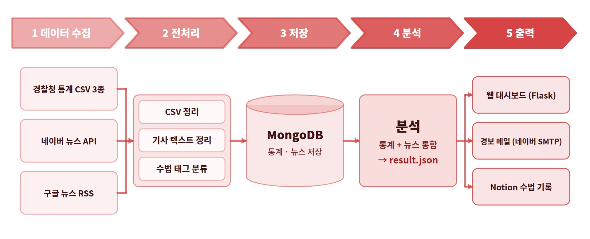

# 보이스피싱 레이더

경찰청 공공 통계와 뉴스 데이터를 결합해 보이스피싱 피해 현황과 최근 유행 수법을 분석하고, 웹 대시보드, 경보 메일, Notion 기록으로 제공하는 시스템입니다.

SK쉴더스 루키즈 35기 파이썬 프로젝트 4조 | 개발 기간 2026.09.29 - 2026.10.01

---

## 프로젝트 개요

**배경.** 보이스피싱은 수법을 미리 알고 있기만 해도 상당 부분 예방할 수 있습니다. 그러나 수법이 계속 바뀌기 때문에 개인이 최신 정보를 직접 찾아 학습하기는 어렵습니다.

**목적.** 통계로 피해의 규모와 특징을 파악하고, 뉴스로 최근 수법을 추적하여 그 결과를 자동으로 정리하고 가족에게 전달합니다.

---

## 시스템 구조



분석 결과는 `result.json` 한 파일로 통합되며, 웹, 메일, Notion은 모두 이 파일만 읽습니다. 출력 담당자가 분석 코드를 기다리지 않고 병렬로 개발할 수 있도록 한 설계입니다.

---

## 데이터 수집 및 활용

| 구분 | 출처 | 수집 내용 | 방식 |
|---|---|---|---|
| 공공데이터 | data.go.kr 경찰청 CSV 3종 | 연령별 피해(2016–2025), 시도청별 건수(2016–2025), 시도청별 금액(2023–2025) | `pandas.read_csv` (cp949) |
| API | 네이버 뉴스 검색 API | 검색어 4개(보이스피싱, 스미싱, 기관사칭, 메신저피싱) 최신순 기사 | `requests`, 헤더 인증, `timeout`, `raise_for_status` |
| RSS | 구글 뉴스 RSS | 기사 제목, 날짜 | `feedparser` |
| 크롤링 | 네이버 뉴스 기사 페이지 | 본문 앞부분 2,000자 | `requests`, `BeautifulSoup`, 요청 간 1초 대기 |

통계는 피해의 규모와 구조를, 뉴스는 현재의 유행 수법을 보여 줍니다. 성격이 다른 두 데이터를 결합해 피해 규모 분석과 최근 수법 추적을 함께 수행합니다. API 키는 `.env`로 분리하고 저장소에는 포함하지 않았습니다.

---

## 데이터 전처리 및 저장

### 전처리

| 구분 | 문제 | 처리 | 위치 |
|---|---|---|---|
| 형식 | CSV 인코딩 | `cp949`로 읽기 | `collect_public.py` |
| 형식 | 연도가 `"2025년"` 문자열, 가로로 펼쳐진 표 | 숫자로 변환, `melt`로 행 단위 변환 | `collect_public.py` |
| 형식 | 금액 단위 억 원 | 원 단위 정수로 통일 | `collect_public.py` |
| 형식 | 제목의 HTML 태그, 날짜 표기 불일치 | 태그 제거, `YYYY-MM-DD`로 통일 | `collect_news.py` |
| 결측 | 지역별 금액은 2023년부터만 존재 | 0으로 대체하지 않고 `null` 유지 | `collect_public.py` |
| 중복 | 검색어와 소스 간 동일 기사 중복 | `link` 고유 인덱스, 저장 전 존재 확인 | `db.py`, `collect_news.py` |
| 잡음 | 예방 캠페인, 홍보성 기사 | `무관` 태그로 분류 후 분석에서 제외 | `classify.py` |

### 저장

| 저장소 | 내용 | 선택 이유 |
|---|---|---|
| MongoDB Atlas | `stats` 240건(연령 60, 지역 180), `news` 기사와 수법 태그 | 문서형 데이터, 팀 공용 DB |
| CSV | `data/raw/` 원본 3종 | 원본 보존 |
| JSON | `data/processed/result.json` 분석 결과 | 출력 모듈 간 공통 인터페이스 |
| Notion | 수법 TOP3 이력 | 누적 기록과 공유 |

검증: 2025년 연령별 합계와 지역별 합계가 모두 23,360건으로 일치함을 코드에서 확인합니다.

---

## 데이터 처리 및 기능 구현

`python run_all.py` 한 번으로 통계 수집, 뉴스 수집, 수법 분류, 분석, 형식 검사, 그래프 생성이 순서대로 실행됩니다.

| 기능 | 내용 | 파일 |
|---|---|---|
| 통계 분석 | 연령대 비율, 시도청별 건수·금액·1건당 피해액, 연도별 추이 | `analysis.py` |
| 수법 분류 | 키워드 규칙 기반 6개 태그 부여, 복수 태그 허용 | `classify.py` |
| 뉴스 분석 | 최근 30일 수법별 건수, TOP3와 대표 기사 | `analysis.py` |
| 결과 검증 | `result.json` 7개 항목 검사 (필수 키, 연령 순서, 시도청 18곳, 건수·금액 합계, 태그 이름 등) | `check_result.py` |
| 자동 실행 | 매주 월요일 09:00 정기 실행 (시연용 1분 간격 설정 가능) | `scheduler.py` |

수법 태그: 기관사칭, 가족·지인사칭, 대출빙자, 스미싱, 메신저피싱, 기타

### 수업 내용 활용

| 수업 | 프로젝트 적용 |
|---|---|
| 01 환경 설정 | `.env` 분리, `.gitignore`, venv, `requirements.txt` |
| 02 제어문, 예외 처리 | 집계 반복문, 조건 기반 분류, 수집과 스케줄러의 예외 처리 |
| 03 함수, 파일, JSON | 기능별 함수 분리, `result.json` 읽기와 쓰기 (`common.py`) |
| 04 정규식, API | 네이버 API 호출, 분류용 정규식 |
| 05 스크래핑, 스케줄링 | 본문 크롤링, `schedule` 기반 정기 실행 |
| 06 SMTP, RSS, MongoDB, Flask | 경보 메일, 구글 RSS, `pymongo` 저장·조회, Flask 라우트와 Jinja2 템플릿 |

수업 외에 `pandas`, `matplotlib`, `notion-client`를 추가로 사용했습니다.

---

## 시각화 및 결과 표현

동일한 분석 결과를 사용 목적에 따라 세 가지 형태로 제공합니다.

| 출력 | 목적 | 구성 |
|---|---|---|
| 웹 대시보드 (Flask) | 현재 상태 확인 | 핵심 지표 카드, 수법 TOP3, 인사이트, 그래프, 연령대 비율, 시도청 표, 뉴스 목록과 태그 필터 |
| 경보 메일 | 가족에게 알림 | 수법 TOP3와 대표 기사 링크, 대응 체크리스트, 대시보드 링크 |
| Notion | 이력 보관 | 수법, 기사 수, 대표 기사, 날짜를 주기마다 자동 기록 |

그래프(`matplotlib`): 연령대별 피해, 시도청별 피해금액, 수법별 기사 수, 연도별 추이

**Notion을 사용하는 이유.** 대시보드는 최신 결과만 보여 주고 메일은 발송 후 사라지므로, 수법 변화의 이력을 남길 저장소가 필요했습니다. Notion은 별도 서버 없이 팀원 누구나 조회하고 의견을 남길 수 있습니다.

---

## 분석 결과 및 인사이트

### 피해의 규모와 특징 (경찰청 2025년, 23,360건, 1조 2,578억 원)

| 발견 | 시사점 |
|---|---|
| 2023년 대비 2025년 건수 +24%, 금액 약 2.8배 (4,473억 원, 1조 2,578억 원). 1건당 피해액 2,366만 원, 5,384만 원 | 건수보다 피해의 고액화가 문제이며, 큰 금액 이체 전 확인 절차가 필요하다 |
| 60대 24.8%, 20대 이하 24.7% | 고령층만의 문제가 아니며, 청년층 대상 예방 교육이 필요하다 |
| 서울과 경기남부가 건수의 46.6%, 금액의 50.8% (서울 1건당 6,681만 원, 전국 평균의 1.2배) | 수도권에 피해가 집중되어 있다 |

### 최근 유행 수법 (최근 30일 뉴스 1,170건)

| 순위 | 수법 | 기사 수 | 비율 |
|---|---|---|---|
| 1 | 기관사칭 | 241 | 20.6% |
| 2 | 스미싱 | 240 | 20.5% |
| 3 | 메신저피싱 | 37 | 3.2% |

기관사칭과 스미싱이 전체 보도의 41.1%를 차지하며, 이 결과가 경보 메일의 핵심 내용이 됩니다.

---

## 협업 및 형상 관리

| 역할 | 담당 | 파일 |
|---|---|---|
| P1 송승찬 (팀장) | 공통 코드, Flask 웹, 통합, 저장소 관리 | `config.py` `db.py` `common.py` `app.py` `run_all.py` |
| P2 김선영 | 뉴스 수집, 수법 분류 | `collect_news.py` `classify.py` |
| B1 이효정 | 경찰청 CSV 정리, 통계 분석 | `collect_public.py` `analysis.py` |
| B2 고은재 | 그래프 | `charts.py` |
| B3 홍주희 | 경보 메일, 스케줄러 | `mailer.py` `scheduler.py` |
| B4 윤예주 | Notion 기록, 인사이트, 발표 자료 | `notion_sync.py` |

**개발 방식**
- 데이터 형식 사전 합의: 태그 6개, 연령대 6개, 시도청 18곳, `result.json` 항목 이름을 `config.py` 기준으로 고정했습니다.
- 병렬 개발: 형식만 동일한 임시 `result.json`을 먼저 공유해 분석 완성 전에도 그래프, 메일, Notion, 웹을 동시에 개발하고, 마지막에 실제 데이터로 교체했습니다.
- 브랜치 전략: `역할-작업` 형식의 브랜치(`b2-charts` 등)에서 작업하고 Pull Request를 통해 팀장 검토 후 `main`에 병합했습니다. `main` 직접 push는 금지했습니다.
- 이력: 커밋 30여 건, 병합된 Pull Request 5건, 병합 충돌은 팀장이 해결했습니다.
- 보안: `.env` 미커밋, 키는 개인 메시지로만 전달, 공용 DB 일괄 삭제 금지, 메일·웹 출력 시 HTML 이스케이프 처리를 적용했습니다.
- 진행 관리: Notion 진행도 페이지에 일자별 기록을 남겼고, 일정 중 발생한 변경(메일 발송을 Gmail에서 네이버 메일로 변경)을 반영했습니다.

---

## 한계 및 개선 방향

| 한계 | 개선 방향 |
|---|---|
| 지역별 금액 데이터가 2023년부터만 제공됨 | 데이터 갱신 시 비교 기간 확대 |
| 경보 메일의 대시보드 링크가 `http://127.0.0.1:5000`(로컬 주소)이라, 대시보드를 실행 중인 PC에서만 열린다. 수신자가 다른 기기나 외부 네트워크에서 클릭하면 접속할 수 없다 | 대시보드를 클라우드 서버에 배포하고, 공개 주소를 `.env`의 `DASHBOARD_URL`에 지정해 어디서든 열리게 한다 |

---

## 실행 결과 캡처

실행 결과 화면은 `result_photos/` 디렉터리에 있습니다.

| 파일 | 내용 |
|---|---|
| `web_result_01.png` - `web_result_04.png` | 웹 대시보드 |
| `mail_result.png` | 경보 메일 |
| `notion_result.png` | Notion 수법 기록 |

---

## 실행 방법

```bash
git clone https://github.com/seungchan-song/voicephishing-radar.git
cd voicephishing-radar
python -m venv venv
venv\Scripts\activate
pip install -r requirements.txt
```

`.env.example`을 `.env`로 복사하고 MongoDB, 네이버 API, 메일, Notion 값을 입력합니다.

```bash
python run_all.py        # 수집, 분류, 분석, 검사, 그래프 생성
python app.py            # 웹 대시보드 (http://127.0.0.1:5000)
python mailer.py         # 경보 메일 발송
python notion_sync.py    # Notion 기록
python scheduler.py      # 정기 자동 실행
```

## 기술 스택

Python, pandas, requests, BeautifulSoup, feedparser, pymongo (MongoDB Atlas), matplotlib, Flask, smtplib, schedule, notion-client, python-dotenv
